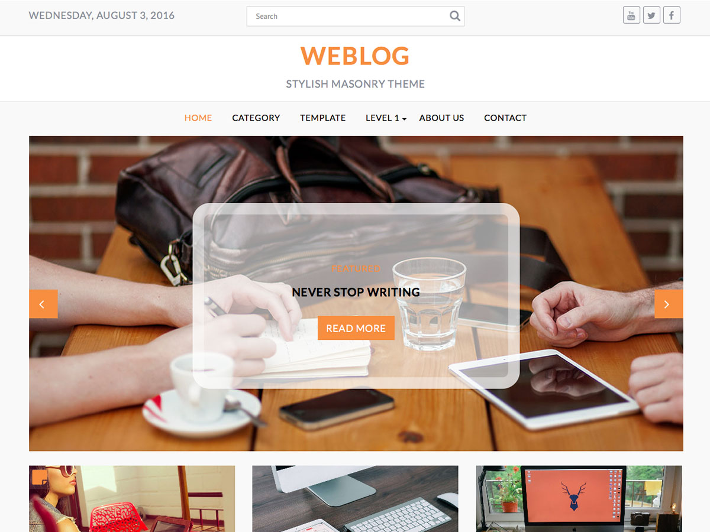

# Weblog

**Contributors:** acmethemes  
**Requires at least:** 6.6  
**Tested up to:** 7.0  
**Requires PHP:** 7.4  
**Stable tag:** 4.0.0  
**License:** GPLv2 or later  
**License URI:** https://www.gnu.org/licenses/gpl-2.0.html  

> 

Weblog is a professional blog theme with a masonry layout and infinite scroll, perfect for blog, news, and magazine sites. Lightweight and highly customizable, it gives you full control over your featured section, homepage layout, sidebar, and header — while keeping your content front and center.

## Features

- **Masonry layout with infinite scroll** — dynamic, engaging post display
- **Featured section** — full customizer control over content and styling
- **Flexible layout** — full-width or boxed mode
- **Sidebar options** — left, right, or no sidebar
- **Customizable header** — logo, date, search bar, and social icons
- **Related posts** — keep readers engaged after the article
- **Post navigation** — easy browsing between posts
- **Breadcrumb navigation** — SEO-friendly site structure
- **Image control** — enable/disable images on blog and archive pages
- **One-click color change** — update your entire site palette instantly
- **Custom CSS** — advanced styling without a child theme
- **Custom background image** — add personality to your site
- **Author widget** — display author bios and social links
- **Custom copyright text** — personalize your footer
- **Post formats** — standard, gallery, image, and video
- **Translation ready** — .pot file included
- **RTL support** — right-to-left language compatible
- **Responsive & SEO friendly** — accessible and discoverable

## Installation

1. Download the theme zip file.
2. In your WordPress admin, go to **Appearance → Themes**.
3. Click **Add New** → **Upload Theme**.
4. Select the zip file and click **Install Now**.
5. Click **Activate**.

## Frequently Asked Questions

### How do I customize the theme?

Go to **Appearance → Customize** — all options for layout, colors, featured section, header, and footer are available there.

### What image sizes should I use?

Set your media sizes in **Settings → Media**:
- Thumbnail: 500 × 280 (cropped)
- Medium: 690 × 400
- Large: 1080 × 530

## Credits

Weblog is built on [Underscores](https://underscores.me/) and licensed under GPLv2 or later. It bundles the following third-party resources:

- [Google Fonts](https://fonts.google.com/) — Apache License 2.0
- [Font Awesome](https://fontawesome.com/) — MIT / SIL OFL 1.1
- [normalize.css](https://necolas.github.io/normalize.css/) — MIT
- [BxSlider](https://bxslider.com/) — MIT
- [SlickNav](https://github.com/ComputerWolf/SlickNav) — MIT
- [Theia Sticky Sidebar](https://github.com/WeCodePixels/theia-sticky-sidebar) — MIT
- [Breadcrumb Trail](https://github.com/justintadlock/breadcrumb-trail) — GPLv2+
- [TGM Plugin Activation](http://tgmpluginactivation.com/) — GPLv2+
- [html5shiv](https://github.com/afarkas/html5shiv) — MIT
- [Respond.js](https://github.com/scottjehl/Respond) — MIT

---

[Demo](https://www.acmethemes.com/demo/?theme=weblog) &middot; [Support](https://www.acmethemes.com/supports/) &middot; [Acme Themes](https://www.acmethemes.com)
